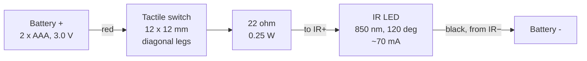

# IR Graffiti — spray can tracker

A handheld spray can emits infrared; a camera watches for it and paints where it
points.

**Status: it works.** A person picks up the can, points it at the TV, holds the
button and paints. All three of the original blockers are closed — manual
exposure, the LED's beam angle, and the Pi's power supply — and the Pi boots
into the wall unattended.

It works on the *interim* optics: a modified C910 behind a strip of VHS tape.
The mono global-shutter camera and the 850 nm bandpass filter are still in
transit, and they are what will make it robust rather than merely working.
Honest summary of where it stands:

| | |
|---|---|
| Can: 850 nm, 120°, one emitter | ✅ tracks reliably at painting distance |
| Power | ✅ 5 V/5 A negotiated, no throttling |
| Tracker | ✅ 30 fps, 4.6× margin over threshold |
| Wall app, calibration, painting | ✅ |
| Controls usable with the can | ✅ colour, mode, size |
| Boots into the wall by itself | ✅ user services, always ends at calibration |
| Rendering | ✅ **58.4 fps while painting** on a Pi 5 at 720p — the rewrite, against 24 for the original |
| Cooling | ✅ Active Cooler fitted: 53 °C, `throttled=0x0`, full 2.4 GHz (was 82 °C and throttling) |
| Latency | ⚠️ dominated by the C910's USB/MJPEG pipeline, ~60–130 ms, which only the CSI camera removes |
| Mono camera + bandpass filter | ⏳ in transit, untested |
| Usable cone angle | ⏳ never measured — `tools/pi/measure.py` is ready |
| Multiple simultaneous users | ❌ unsolved, unscoped |

## Try it

**▶ [bnhovde.github.io/ir-graffiti/test-wall.html](https://bnhovde.github.io/ir-graffiti/test-wall.html)**

Served from GitHub Pages off `main`, so it updates on every push.

- **Camera on the same machine:** camera panel → **IR can** → pick the camera →
  **Diagnostics** → **Calibrate 4 corners**.
- **Tracking on a Pi:** camera panel → **IR (Pi)** → **Connect** (it prefills
  `ws://<host>:8765`) → **Calibrate 4 corners**. The browser never sees pixels in
  this mode, only coordinates, so the diagnostics overlay has nothing to draw —
  use the tracker's own `/preview` instead.

Mouse and touch work without any of the hardware, if you just want to see the
wall itself.

To run it locally instead:

```bash
python3 -m http.server 8731
open http://localhost:8731/test-wall.html
```

Use `localhost`, not `file://` — `getUserMedia` only works in a secure context,
which `localhost` and HTTPS satisfy and a local file does not.

---

## Running it on the Pi

The Pi boots into the wall. Two systemd **user** services do it — user rather
than system because the browser needs the compositor, and `WAYLAND_DISPLAY`
only means anything inside the graphical session. The Pi autologins, so the
session exists at boot and these come up with it. No `linger`, no `sudo`.

```bash
git clone https://github.com/bnhovde/ir-graffiti ~/ir-graffiti
cd ~/ir-graffiti && ./tools/pi/install-pi.sh
systemctl --user restart irtracker irkiosk
```

| | |
|---|---|
| `irtracker` | the tracker: camera, detection, WebSocket on :8765, HTTP on :8000 |
| `irkiosk` | `start-kiosk.sh` — waits for the compositor, sets 720p, launches Chromium, connects it to the tracker, **starts calibration** |
| logs | `~/ir-graffiti/tracker.log`, `~/ir-graffiti/kiosk.log` |

**It always ends at the four corner targets.** The homography lives in the page,
so every restart genuinely needs it redone — and a wall that looks alive but
paints nothing is worse than one visibly asking to be calibrated.

720p is set on every boot because `wlr-randr` does not persist, and because the
resolution is the wall's frame rate: measured ~10 fps at 1440p, ~15 at 1080p and
34+ at 720p. The cost is pure fill rate.

### Why there are two walls

[`wall.html`](wall.html) is the one that boots. [`test-wall.html`](test-wall.html)
is the original and stays as a fallback — `WALL_URL` in `start-kiosk.sh` switches
between them.

The rewrite exists because the original's losses were structural, not tuning.
Measured on the Pi at 720p, while painting:

| | original | rewrite |
|---|---|---|
| painting | 24 fps | **58.4 fps** |
| idle | 60 fps | 60 fps |

Three canvases composited every frame became one that is never cleared; a
full-screen overlay cleared per frame to draw a cursor became a DOM element
moved by a transform; per-stamp gradients became cached bitmaps; and the
backing store is capped at 1×. Nothing animates on its own, so an idle wall
costs nothing and each theme's effects are paid for only while that theme is
selected.

### Operating it at the exhibition

The wall boots by itself and ends at the four corner targets. Everything else
is reachable **with the can alone** — rest it on a control and hold; a ring
fills, then the menu opens; move to highlight, release to pick.

| control | where | what |
|---|---|---|
| sizes · mode · colours | bottom left | five brush sizes, four modes, four colours |
| clear | top right | **hold ~1.8 s** — twice the menu dwell, because it wipes the wall |
| the frog | bottom right | **Calibrate · Reload · Friedolin · Sound** |

**Calibrate** is the one to know. The homography lives in the page, so any
reload needs it redone — and if the camera is nudged, the paint will land in
the wrong place until you recalibrate. It is in the frog menu precisely so
nobody needs a keyboard to fix it.

**Friedolin** places a large frog stencil: paint fills the silhouette and is
cut off outside it. Same item toggles it off.

**Sound** mutes the spray hiss and the choice persists. Worth knowing before
opening rather than after.

Modes are isolated by construction: Space builds its own animated layer on
entry and tears it down on exit, so nothing pays for it while another mode is
selected. Two cans paint at once, sharing a brush — the tracker matches spots
between frames, and when they cross the identities swap, which is invisible
while both use the same colour.

### Driving it with no mouse or keyboard

The exhibition Pi has neither, so [`tools/pi/kiosk.py`](tools/pi/kiosk.py) drives
the page over the Chrome DevTools Protocol:

```bash
python3 tools/pi/kiosk.py --status          # tracker state, calibration, lock
python3 tools/pi/kiosk.py --calibrate       # restart the 4-corner calibration
python3 tools/pi/kiosk.py --latency         # end-to-end latency, while painting
python3 tools/pi/kiosk.py 'app.clearCanvas()'
```

Also useful: `http://graffiti.local:8000/preview` is a live contrast-stretched
camera view for aiming (a correctly exposed IR frame looks black to a human),
and `/debug-pointer.html` shows just the tracked dot with a latency readout — no
canvas, no painting, so it is the floor the wall can be compared against.

---

## The can

Six printed parts, modelled parametrically in [`canv2.scad`](canv2.scad). All
print without supports. About 160 mm tall, 60 mm diameter.

| Part | Key dimensions | Notes |
|---|---|---|
| `body` | ⌀60 × 145 | 2 mm wall, 15 mm shoulder cone, 18 mm neck with a snap bead. Prints upright, open end down. |
| `cap_body` | ⌀36 × 22.6 | Internal shelf carries the button plate so press force goes into the can, not the plate. Nozzle spout ⌀18, standing 4 mm proud, with the LED cast in its face. |
| `cap_top` | ⌀36, 4.1 plug | Snaps on via a split collet. Pry slot at the seam opposite the nozzle. |
| `button_disc` | ⌀31.7 × 2.5 | Holds the switch. Pin holes on a 12.5 × 4.5 grid. |
| `bottom_cap` | ⌀60 × 65.5 | Snap-in base with a slide-in cradle for the battery holder. Two pry slots at 0° and 180°. |
| `nozzle_cap` | ⌀14.9 × 0.8 | The bezel. Presses into the nozzle rebate and clamps the LED into its cast. Prints flat. |

Set `part=` to export one part, or leave it at `"all"` for the layout view.
Exported STLs are in [`stl/`](stl). Everything derives from the parameter block
at the top; the numbers worth knowing are `fit` (0.30, raise it if parts bind),
`hold_w` (36.20, cut for the CM battery holder), and the LED block below.

### How the emitter mounts

The LED **drops into a cast in the front of the nozzle** and a thin bezel presses
on over it, leaving the body and dome outside. Same pattern as `button_disc`
sitting on its shelf under `cap_top`: a part in a recess, closed by a cover.

Three steps in from the nozzle face:

```
0.0 → 0.8    ⌀15.0 rebate      the bezel sits here
0.8 → 2.0    ⌀8.4 + tab slot   the cast: the LED's own silhouette
2.0 → 2.4    ⌀6.6 relief       so the body seats on its rim, not the slug
```

Two ⌀2.5 wire holes run from the cast back into the wiring chamber. **Solder the
leads on, feed them through, drop the LED in, press the bezel on.**

| Parameter | Value | Why |
|---|---|---|
| `pled_cover_t` | 0.8 | Bezel thickness — all that sits beside the dome, so as thin as the printer holds |
| `pled_cover_fit` | 0.10 | Bezel to rebate. Tight on purpose: a press fit, not the sliding `fit` used elsewhere. A drop of glue behind it if you want it permanent |
| `pled_tab_span` | 14.5 | Untrimmed. Sizes the cast and hence the spout |
| `pled_tab_stag` | 1.5 | The tabs are **staggered, not opposite**. Slot is `tab_w + this`, centred, so the part goes in either way up. Read off a drawing — measure yours |
| `pled_body_h` | 2.4 | Tab plane to body top. Sets how far the body protrudes; more just means more sticks out |

The body ends up 1.2 mm proud and the dome tip 3.8 mm clear of the face, with
nothing in front of the dome — the full 120°.

> [!NOTE]
> **An earlier version loaded the LED from inside the cap**, sliding it forward
> down the bore onto a shoulder, with the tabs as retention. It verified fine and
> was almost impossible to build: you were threading a part with leads already
> soldered to it down a channel you could not see into. Front-loading also means
> the LED never enters the wiring chamber, so the chamber — and the whole cap —
> goes back to its original height, 24.6 mm rather than 28.3.

> [!TIP]
> The ⌀15 rebate ceiling is the largest bridge in the part, about 10 mm across
> but only 0.8 mm deep. If it sags enough that the bezel will not seat flush,
> scrape it or raise `pled_cover_fit`.

### Electronics

| Item | Spec | Notes |
|---|---|---|
| IR LED *(incoming)* | 1 × 8 mm star emitter, **850 nm, 120°**, 3 W rated | Body ⌀8.0 (7.2 across the flats), dome ⌀6.0 × 2.6 tall, thermal slug ⌀6.2, tabs 1.5 × 1.05 spanning 14.5, marked IR+ / IR−. Vf 1.4–1.7 V at 500 mA — **single die, so it runs on 3 V**. Some parts sold as "3 W" are three dies in series at 4.5–5 V and will not light at all here; check before wiring. |
| Resistor | **22 Ω**, 0.25 W | One, in series. Gives ~70 mA — 4× the old drive with plenty of margin. 15 Ω takes it to ~110 mA if you want more range. **Do not drive it at the rated 500 mA:** that is 0.75 W with no heatsink, in a plastic cap, and 2×AAA sag badly at that current. At 70 mA the LED dissipates ~0.1 W and heat is a non-issue. |
| Switch | 12 × 12 mm tactile | 4-leg. See wiring warning below. |
| Battery | 2 × AAA, 3.0 V | Printed holder `AAA_holder_di_CM.stl` from [`AAA_holder.3mf`](AAA_holder.3mf), 36.2 × 56.5 × 12 mm, slides into the base cradle. |
| Camera | Logitech C910, or OV9281 *(incoming)* | See below. |
| Host | Raspberry Pi 5 | Runs the tracker and the browser. **Needs the 27 W supply** — see findings. |

**Superseded:** 2 × ⌀3 mm 940 nm ([Fibel](https://www.fibel.no/product/940nm-sender-og-mottaker-ir-leder/)) at 17 mA through 100 Ω each. Kept here only so the old wiring is recognisable. 940 nm is the worst case for a silicon sensor and the ~±20° beam is what the whole rebuild is about.

---

## Wiring

One branch, one LED. Pressing the button lights it, and that *is* the trigger
signal — the tracker treats "LED visible" as pen-down, so the button needs no
telemetry of its own.



Polarity is printed on the part: **IR+** and **IR−** next to their tabs, so there
is no long-leg/short-leg guessing any more.

> [!TIP]
> **Solder the leads before fitting the LED**, then feed them back through the
> wire holes. The tabs are bonded to the thermal slug and sink heat fast, so use
> a big tip and be quick.

> [!WARNING]
> **Which switch legs.** On a 4-leg tactile switch the two legs **12.5 mm apart,
> straight across the body,** are one terminal. The two close together on the
> same side are *opposite* terminals — bridging those shorts the switch
> permanently on. Wire two diagonally opposite legs and clip the other two;
> diagonals are always one from each terminal, which is why that's the standard
> trick.

---

## The camera

No longer the weak link — moving the tracker onto a Pi fixed the part that
mattered. The C910 on a Pi is a genuinely usable camera.

### Working today: modified C910 on the Pi

| | |
|---|---|
| **Body** | Logitech C910. USB 2.0 UVC, colour sensor, autofocus, ~78° diagonal field. Roughly 70° horizontal in 16:9, so lateral coverage is about 1.4 × distance. |
| **IR-cut filter** | **Removed.** Physically taken out of the lens stack so the sensor can see near-IR at all. This shifts the focal plane — IR focuses differently from visible — so autofocus sits slightly wrong and is locked in software. |
| **IR-pass filter** | **A strip of VHS tape over the front glass.** Improvised and the weakest optical element in the chain. Worth 2–8× to replace with real filter glass. |
| **Exposure / gain** | **Manual, and it works.** `auto_exposure=1`, `exposure_time_absolute=60` (6 ms), `gain=128`, verified by readback. On macOS every one of these returned min 0 / max 0. See the settings finding below — 2 ms / gain 8 was wrong for this optical chain and capped the range. |
| **Format** | **MJPEG, forced.** V4L2 hands back uncompressed YUYV by default and 720p of that exceeds USB 2.0 bandwidth, so the camera silently settles at 10 fps. Asking for MJPEG first gets 30. |
| **Enumeration** | USB VID `0x046d`, PID `0x0821`. `/dev/video0` on the Pi. |

### Incoming: OV9281 + 850 nm bandpass

Mono global shutter, no Bayer filter (~3× the sensitivity of the colour C910),
and a proper filter instead of tape. Together worth roughly 6–24× signal, which
buys **range**, not angle — see the finding on beam width below.

> [!CAUTION]
> **Do not fit the 850 nm bandpass with the old 940 nm LEDs.** A narrow 850 nm
> passband rejects 940 nm by three or four orders of magnitude. You would see
> nothing at all, and it looks exactly like a dead camera. Swap the LED and the
> filter together.

One risk to watch: narrow bandpass filters blue-shift with incidence angle, so
transmission can fall at the edges of a wide field of view. If the screen corners
go dark, that is why — a wider filter or a 780 nm longpass is the fix.

---

## Two camera geometries, one of them dead

The project was originally drafted around bouncing IR off the wall and watching
the reflection from the back of the room. That does not work and cannot be made
to work at this power level. The camera now sits **at the wall, looking back at
the user**, so it sees the LED directly.

| | Bounce off the wall | Direct view |
|---|---|---|
| Camera position | Back of the room | At the wall, facing the user |
| Path | LED → wall → scatter → camera | LED → camera |
| Result | **No reading at all** | **Verified to 3 m** |
| Shortfall | ~1000× too dim | — |

A diffuse wall scatters the LED's output over a hemisphere and the camera then
collects a vanishing fraction of it. Closing that gap would need several watts
per steradian — an illuminator array, not two LEDs on a pair of AAAs. Correctly
abandoned; **do not revisit.**

The cost of the direct path is that the camera only covers about 1.4 × its
distance from you, so a 2 m wall means standing ~1.5 m back, and accuracy
depends on a homography calibrated at roughly that distance.

---

## Findings

Measured, not assumed.

### ✅ Direct-view tracking reaches 3 m

With the VHS filter fitted, the old 3 mm LEDs at 17 mA and no other
optimisation, the camera tracked the LED reliably to about 3 m **when pointed at
the lens**. That last clause is the whole problem — see the beam-angle finding —
but as a range figure it is the baseline everything else is measured against.

### ❌ Bouncing off the wall is ~1000× short

No reading whatsoever off a wall, at any distance, while the direct path was
comfortable. See above.

### ❌ macOS will not expose UVC camera controls — ✅ Linux will

`uvcc` enumerates the C910 correctly on macOS but every control transfer hangs,
and `uvcc ranges` returns min 0 / max 0 for every control: the system's own UVC
driver owns the control interface and will not release it. AVFoundation ignores
exposure and gain too.

**On the Pi the same camera reports `exposure_time_absolute` min 3 max 2047 and
honours it.** This was the project's oldest blocker and the fix was to change
host, not camera. At 2 ms with gain 8 the room reads luma 5 — near-black — which
is exactly the intent: ambient accumulates with exposure time while the LED
saturates almost instantly.

### ✅ Settings, measured rather than assumed

The working configuration for the modified C910 behind VHS tape:

```
exposure  6000 us (6 ms)      gain  128
min_luma  25                  floor 12
```

Exposure sweep, LED at painting distance, gain 128:

| exposure | sig | thr | result |
|---|---|---|---|
| 2 ms | 16.9 | 12.0 | no detection |
| **6 ms** | **55.4** | 12.0 | **LOCKED** — 4.6× margin, threshold still on its floor |
| 10 ms | 78.6 | 17.2 | locked, but margin flat |
| 20 ms | 123.6 | 29.7 | locked, ambient now paying for it |

Past 6 ms the adaptive threshold rises with the signal, so the margin stops
improving and only the room light grows. Short exposure is still what rejects
ambient — 6 ms is short — but **2 ms was dogma, not a measurement**, and it was
carried for most of this project on the strength of the sentence above it.

Two settings were quietly limiting range for weeks:

- **`min_luma` is an ABSOLUTE pixel threshold**, so its meaning moves with gain
  and exposure. It was set to 55 once, to kill false positives, and from then on
  a blob had to exceed 55/255 no matter how the camera was configured. It should
  sit just above sensor noise and let the adaptive threshold and the persistence
  gating filter properly.
- **`--gain` meant different things on the two backends** — an analogue
  multiplier on picamera2, a 0–255 register on a UVC webcam — and shared one
  default of 8.0. Sensible for picamera; very nearly nothing on a webcam. The
  C910 ran at 8/255 for this entire project. Each backend now carries its own
  default.

Symptom to recognise: detection that works close up and **vanishes as a cliff**
rather than fading. That is an absolute gate, not a weak emitter. Hours went into
checking the LED, the batteries, the solder joints and the camera aim, all of
which were fine, because a working measurement of `peak 66` against a gate of
`55` was read as "working" rather than "20% from failing".

### ⚠️ Current blocker: the LED's beam, not the signal

The old 3 mm LEDs held lock only within roughly ±20°, so the can had to be aimed
at the camera rather than painted with.

The decisive measurement: **the same ±20° cone appeared on a Mac at ~16 ms auto
exposure and on a Pi at 2 ms manual.** Two sensitivity regimes an order of
magnitude apart, identical usable angle. A signal problem cannot survive that, so
the limit is the beam.

The arithmetic agrees. Falloff is roughly cos²²θ, so sensitivity barely moves the
angle — 6–24× more signal widens the usable half-angle from about 20° to 23–30°.
The same 6–24× spent on range buys 2.4–5×, because that goes as the square root.

**The fix is a wider emitter, not a brighter one.** A 120° part changes the
exponent rather than the multiplier. At 45° off-axis the old LED is at ~0.0005 of
peak and a 120° one is at ~0.7.

### ✅ The C910's first open returns a dead stream

Worth knowing because it wastes an evening. The camera enumerates, streams at a
valid 30 fps, and every pixel of every frame is the same value. It looks exactly
like a blocked lens. The kernel log shows the real cause — the first probe fails
with `-5` and the device re-enumerates — and Photo Booth shows the same thing:
you have to select the camera, select another, and select it back.

`tracker.py` now validates at startup while still on auto exposure, where a live
sensor always shows read noise, and reopens on a single-valued frame. Checking
after the switch to 2 ms would not work: a dark room at 2 ms is legitimately
almost flat.

### ❌ A 15 W supply will not run a Pi 5 with this camera

Three hard crashes, then a fourth. The firmware says why:

```
max_current              = 3000     5 V x 3 A = 15 W
usb_max_current_enable   = 0        USB peripherals capped at 600 mA total
usbpd_power_data_objects = 0 0 0    no PD profile offered at all
```

A MacBook charger does not advertise a 5 V/5 A profile, so the Pi falls back to
5 V/3 A and clamps **all** USB peripherals to 600 mA combined. The C910 alone can
draw 500 mA of that. Under load the board browns out and resets.

Confirmed by watching `vcgencmd get_throttled` flip to `0x50000` (under-voltage
and throttling both latched) within 20 seconds of the camera streaming, **with no
browser running at all**. Dropping the display to 1080p helped and was not
enough.

Use the official 27 W supply. Do **not** set `usb_max_current_enable=1`, the
common forum advice — it lifts the safety cap without adding a single watt, and
converts a clean refusal into an unpredictable brownout. A powered hub for the
camera is a legitimate workaround; it takes 500 mA off the Pi's budget entirely.

---

## Open questions

**~~Projector lamp~~ — settled.** The display is an **LED TV**, which emits no
meaningful near-IR, so the projector-lamp question is moot and a modest filter
suffices. Recorded because it drove several earlier decisions.

**Multi-user — unsolved, and in scope.** Identical IR LEDs are indistinguishable
and the tracker finds exactly one blob. Two cans in frame gives two spots with no
way to tell which is which. Telling them apart means blink-coding an ID into each
can, which means a microcontroller per can. None of the incoming hardware
addresses this. It is genuine new engineering and remains unscoped.

**Calibration in anger.** The 4-corner homography has never been completed on the
Pi — the board browned out first. Nothing paints without it: `processFrame()`
returns null with no homography, by design.

**Room lighting** — less of a risk than it sounds. Behind a proper filter, LED
and fluorescent lighting are nearly invisible; they emit almost no near-IR.
Brightness is not the variable, spectrum is. Halogen, incandescent and daylight
are the ones that hurt.

---

## Next step

Assemble the new emitter and **measure the usable cone before changing anything
else**. Hold the can at a fixed distance and rotate it until lock drops. If that
is not at least ±45°, the beam-angle reasoning above is wrong and the right move
is to re-measure, not to pile on more changes.

Then, in order: 27 W supply, new camera and filter together, 4-corner
calibration, and only then multi-user.

> [!NOTE]
> **A correction worth keeping.** An earlier version of this file recommended
> TSAL6100/6200-class emitters, chosen for intensity. Those are narrow-beam parts
> — roughly ±10° and ±17° — and that advice was backwards. Now that beam angle is
> known to be the binding constraint and there is 30× of sensitivity in reserve
> (the tracker locks at gain 8 of 255 and 2 ms of a possible 205), the selection
> criterion is the **widest** half-angle available at 850 nm, not the brightest.

**Rear projection is also dead** as a suggestion: the display is an LED TV.

None of the can hardware is wasted by any of this. Enclosure, button, battery
holder and switch wiring all carry over; only the LED and its resistor change.

Sourcing from Norway: Digi-Key, Mouser and Elfa Distrelec all ship and are
VOEC-registered (VAT at checkout, no customs handling fee). Arducam direct, The
Pi Hut, or BerryBase for the camera. AliExpress is fine for the filter.

---

## Repository layout

| Path | What |
|---|---|
| [`canv2.scad`](canv2.scad) | Parametric model, all five parts |
| [`stl/`](stl) | Exported STLs |
| [`AAA_holder.3mf`](AAA_holder.3mf) | Third-party battery holder. Use the `AAA_holder_di_CM.stl` variant — the cradle is cut for its 36.2 mm width |
| [`test-wall.html`](test-wall.html) | The wall app — [live](https://bnhovde.github.io/ir-graffiti/test-wall.html). Has an **IR can** camera mode: pure-JS blob tracking, rolling background, 4-corner homography calibration, and a diagnostics overlay showing the brightest pixel with no thresholding applied. `app.irTracker` is exposed on the console for tuning |
| [`tools/pi/tracker.py`](tools/pi/tracker.py) | **The Pi tracker.** Captures, finds the blob, broadcasts normalised coordinates over a WebSocket on :8765, and optionally serves the repo over HTTP. `--source picamera\|webcam\|synthetic`. Also serves a live contrast-stretched camera preview at `/preview` for aiming — necessary because a correctly exposed IR frame looks black to a human |
| [`tools/pi/kiosk.py`](tools/pi/kiosk.py) | Drives the wall app in a kiosk browser over the Chrome DevTools Protocol, for a Pi with no mouse. `--connect`, `--calibrate`, `--status`. Also takes a screen wake lock |
| [`tools/irtest.py`](tools/irtest.py) | Standalone Python tuner for the same pipeline, with a live HUD. Needs `opencv-python` |
| [`tools/ircam-setup.sh`](tools/ircam-setup.sh) | Attempts manual camera control via `uvcc`. **Known not to work on macOS**, and superseded on Linux by `tracker.py`, which sets the same controls through `v4l2-ctl` and reads them back |
| [`canv1.scad`](canv1.scad) | Superseded first draft, kept for reference |

### Reading the diagnostics overlay

In order — each step is only worth doing if the previous one passed.

0. **In Pi mode, none of this applies** — the browser receives coordinates, not
   pixels. Use the tracker's `/preview` page and its `--stats` line instead.
1. **`camera`** — if that's not the modified camera, nothing else matters.
2. **Red cross** — the brightest pixel in the frame, no thresholds at all. Press
   the button. If red doesn't jump to the LED, the problem is upstream of all
   this software.
3. **`maxLuma` / `maxSig`** with the LED on vs off. That difference is the entire
   signal budget.
4. Only if red lands correctly but no green circle appears is the sensitivity
   slider (`k`) the thing to touch.
