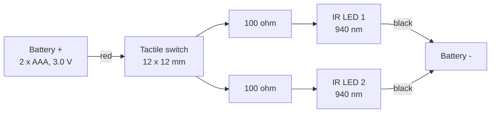

# IR Graffiti — spray can tracker

A handheld spray can emits infrared; a camera watches for it and paints where it
points. The can works. The camera is the problem — and specifically, the fact
that macOS will not let us set its exposure.

**Status:** the concept is sound and partly proven. Direct-view tracking works at
3 m today with unoptimised parts. Two things block progress: the LED's narrow
beam means the can must be aimed at the camera rather than painted with, and the
webcam offers no manual exposure control, which is the single most important
setting for rejecting ambient light. Both are fixed by buying different parts,
not by more software.

## Try it

**▶ [bnhovde.github.io/ir-graffiti/test-wall.html](https://bnhovde.github.io/ir-graffiti/test-wall.html)**

Served from GitHub Pages off `main`, so it updates on every push. Camera panel →
**IR can** → pick the camera → **Diagnostics** → **Calibrate 4 corners**.

Mouse and touch work without any of the hardware, if you just want to see the
wall itself.

To run it locally instead:

```bash
python3 -m http.server 8731
open http://localhost:8731/test-wall.html
```

Use `localhost`, not `file://` — `getUserMedia` only works in a secure context,
which `localhost` and HTTPS satisfy and a local file does not.

---

## The can

Five printed parts, modelled parametrically in [`canv2.scad`](canv2.scad). All
print without supports. About 160 mm tall, 60 mm diameter.

| Part | Key dimensions | Notes |
|---|---|---|
| `body` | ⌀60 × 145 | 2 mm wall, 15 mm shoulder cone, 18 mm neck with a snap bead. Prints upright, open end down. |
| `cap_body` | ⌀36 × 22.6 | Internal shelf carries the button plate so press force goes into the can, not the plate. Nozzle spout stands 4 mm proud with two ⌀3.2 LED channels. |
| `cap_top` | ⌀36, 4.1 plug | Snaps on via a split collet. Pry slot at the seam opposite the nozzle. |
| `button_disc` | ⌀31.7 × 2.5 | Holds the switch. Pin holes on a 12.5 × 4.5 grid. |
| `bottom_cap` | ⌀60 × 65.5 | Snap-in base with a slide-in cradle for the battery holder. Two pry slots at 0° and 180°. |

Set `part=` to export one part, or leave it at `"all"` for the layout view.
Exported STLs are in [`stl/`](stl). Everything derives from the parameter block
at the top; the numbers worth knowing are `fit` (0.30, raise it if parts bind),
`led_body_d` (3.0 — set 5.0 for 5 mm LEDs and the wiring chamber and nozzle
resize themselves), and `hold_w` (36.20, cut for the CM battery holder).

**Print orientation:** `body` upright open end down · `cap_body` rim up ·
`cap_top` **upside down**, roof on the bed · `button_disc` flat ·
`bottom_cap` plate on the bed.

**To open either end:** flat screwdriver into the slot at the seam, twist. One
at the top opposite the nozzle, two at the bottom so you can walk the cap off
level.

### Electronics

| Item | Spec | Notes |
|---|---|---|
| IR LEDs | 2 × ⌀3 mm, 940 nm | [Fibel 940 nm emitter/receiver pair](https://www.fibel.no/product/940nm-sender-og-mottaker-ir-leder/) — the clear one is the emitter, the black one is a photodiode we don't use. No published datasheet, so beam angle and current rating are unknown. **940 nm is the worst case for a silicon sensor;** 850 nm is worth 2–3× for no other change. |
| Resistors | 100 Ω each | One per LED. Gives ~17 mA per LED — already the continuous rating of a 3 mm part, so the LEDs are the ceiling, not the resistor. Dropping to 47 Ω buys roughly 2× and runs them over spec. |
| Switch | 12 × 12 mm tactile | 4-leg. See wiring warning below. |
| Battery | 2 × AAA, 3.0 V | Printed holder `AAA_holder_di_CM.stl` from [`AAA_holder.3mf`](AAA_holder.3mf), 36.2 × 56.5 × 12 mm, slides into the base cradle. |
| Camera | Logitech C910 | Modified — see below. |

---

## Wiring

Two independent branches off one switch. Pressing the button lights both LEDs,
and that *is* the trigger signal — the tracker treats "LED visible" as pen-down,
so the button needs no telemetry of its own.



Anode (long leg) to the resistor, cathode (short leg, flat side of the rim) to
ground.

> [!WARNING]
> **Which switch legs.** On a 4-leg tactile switch the two legs **12.5 mm apart,
> straight across the body,** are one terminal. The two close together on the
> same side are *opposite* terminals — bridging those shorts the switch
> permanently on. Wire two diagonally opposite legs and clip the other two;
> diagonals are always one from each terminal, which is why that's the standard
> trick.

---

## The camera

The weak link in the whole rig.

| | |
|---|---|
| **Body** | Logitech C910. USB 2.0 UVC, colour sensor, autofocus, ~78° diagonal field. Roughly 70° horizontal in 16:9, so lateral coverage is about 1.4 × distance. |
| **IR-cut filter** | **Removed.** Physically taken out of the lens stack so the sensor can see near-IR at all. This shifts the focal plane — IR focuses differently from visible — so autofocus sits slightly wrong and should be locked. |
| **IR-pass filter** | **A strip of VHS tape taped over the front glass.** Improvised, and the weakest optical element in the chain: it blocks visible light well but passes only a fraction of the near-IR and isn't optically flat, so it scatters and softens the blob. Worth 2–8× to replace with real filter glass. |
| **Exposure / gain** | **Not controllable.** See findings — this is the single biggest problem. |
| **Enumeration** | USB VID `0x046d`, PID `0x0821`. AVFoundation device index 0. The built-in FaceTime camera still has its IR-cut filter and sees nothing, which is why the app has a device picker. |

---

## Two camera geometries, one of them dead

The project was originally drafted around bouncing IR off the wall and watching
the reflection from the back of the room. That does not work and cannot be made
to work at this power level. The camera now sits **at the wall, looking back at
the user**, so it sees the LED directly.

| | Bounce off the wall | Direct view |
|---|---|---|
| Camera position | Back of the room | At the wall, facing the user |
| Path | LED → wall → scatter → camera | LED → camera |
| Result | **No reading at all** | **Verified to 3 m** |
| Shortfall | ~1000× too dim | — |

A diffuse wall scatters the LED's output over a hemisphere and the camera then
collects a vanishing fraction of it. Closing that gap would need several watts
per steradian — an illuminator array, not two LEDs on a pair of AAAs. Correctly
abandoned; **do not revisit.**

The cost of the direct path is that the camera only covers about 1.4 × its
distance from you, so a 2 m wall means standing ~1.5 m back, and accuracy
depends on a homography calibrated at roughly that distance.

---

## Findings

Measured, not assumed.

### ✅ Direct-view tracking reaches 3 m

With the VHS filter fitted, 3 mm LEDs at 17 mA and no other optimisation, the
camera tracks the LED reliably to about 3 m when it is pointed at the lens. This
is the working configuration and the baseline everything else should be measured
against.

### ❌ Bouncing off the wall is ~1000× short

No reading whatsoever off a wall, at any distance, while the direct path was
comfortable. See above.

### ❌ macOS will not expose UVC camera controls

This is the root of most of the difficulty. `uvcc` enumerates the C910 correctly
but every control transfer hangs, and `uvcc ranges` returns min 0 / max 0 for
every control — libusb can read the descriptor, but the system's own UVC driver
owns the control interface and will not release it. AVFoundation ignores
exposure and gain too.

This matters far more than it sounds. **Short exposure is the primary
ambient-rejection technique for IR tracking:** ambient light accumulates in
proportion to exposure time while a bright LED saturates almost instantly. At
1–2 ms a lit room nearly vanishes. Being locked out of that setting is why so
much effort went into background subtraction and adaptive thresholds — all of it
compensating for one unavailable parameter.

### ⚠️ Current blocker: the LED's beam is too narrow to paint with

A 3 mm LED emits over roughly ±20°. Tilt the can and the camera leaves the cone,
so tracking drops — in practice the can has to be aimed at the camera rather
than used naturally. Angular falloff is steep (about cos²²θ), so raw sensitivity
barely helps: a 4× gain widens the usable half-angle from about 20° to 28°.

**Diffusing the emitters is the fix**, taking coverage to roughly ±70–80° at the
cost of 3–5× peak intensity. Frosting the LED domes with fine sandpaper is a
free five-minute test. A proper filter would then buy the lost intensity back.

---

## Open questions

**Projector lamp — decisive, and unanswered.** A UHP or halogen projector floods
the screen with near-IR and the camera will be looking into it. An LED or laser
projector emits essentially none. This one fact determines whether a cheap
longpass filter will do or a proper bandpass is required.

**Multi-user.** Identical IR LEDs are indistinguishable. Telling cans apart means
blink-coding an ID into each, which means a microcontroller per can. This is
genuine new engineering and should be scoped now, since it changes electronics
that are otherwise finished.

**Room lighting** — less of a risk than it sounds. Behind a proper filter, LED
and fluorescent lighting are nearly invisible; they emit almost no near-IR.
Brightness is not the variable, spectrum is. Halogen, incandescent and daylight
are the ones that hurt.

---

## Recommended next step

The current webcam is the weak link, not the concept. For a permanent
installation, replace it rather than continuing to work around it.

- **Mono global-shutter USB camera** (OV9281-based, ~£40–60). Monochrome means no
  Bayer filter and roughly 3× the sensitivity of the colour C910; global shutter
  removes motion skew; and critically, these expose manual controls that work.
- **850 nm bandpass filter** (~£15). Bandpass rather than longpass, so it rejects
  lamp and daylight either side of the LED line.
- **850 nm high-power LEDs** (TSAL6100/6200 class) at ~100 mA — about 15 Ω per
  LED on 3 V — diffused for angle.
- **Fixed short exposure**, ~1–2 ms, with fixed gain and focus. Set once. This is
  what makes the rig immune to room lighting and to the projector.
- **Rear projection, if the venue allows it.** Camera behind the screen looking
  through it: the projector never enters frame, users cast no shadows, and the
  camera is out of public reach.

None of the can hardware is wasted by any of this. Enclosure, button, battery
holder and wiring all carry over unchanged.

Sourcing from Norway: Digi-Key, Mouser and Elfa Distrelec all ship and are
VOEC-registered (VAT at checkout, no customs handling fee). Arducam direct, The
Pi Hut, or BerryBase for the camera. AliExpress is fine for the filter.

---

## Repository layout

| Path | What |
|---|---|
| [`canv2.scad`](canv2.scad) | Parametric model, all five parts |
| [`stl/`](stl) | Exported STLs |
| [`AAA_holder.3mf`](AAA_holder.3mf) | Third-party battery holder. Use the `AAA_holder_di_CM.stl` variant — the cradle is cut for its 36.2 mm width |
| [`test-wall.html`](test-wall.html) | The wall app — [live](https://bnhovde.github.io/ir-graffiti/test-wall.html). Has an **IR can** camera mode: pure-JS blob tracking, rolling background, 4-corner homography calibration, and a diagnostics overlay showing the brightest pixel with no thresholding applied. `app.irTracker` is exposed on the console for tuning |
| [`tools/irtest.py`](tools/irtest.py) | Standalone Python tuner for the same pipeline, with a live HUD. Needs `opencv-python` |
| [`tools/ircam-setup.sh`](tools/ircam-setup.sh) | Attempts manual camera control via `uvcc`. **Known not to work on macOS** — kept because it works on Linux, and it now fails in 6 s rather than hanging |
| [`canv1.scad`](canv1.scad) | Superseded first draft, kept for reference |

### Reading the diagnostics overlay

In order — each step is only worth doing if the previous one passed.

1. **`camera`** — if that's not the C910, nothing else matters.
2. **Red cross** — the brightest pixel in the frame, no thresholds at all. Press
   the button. If red doesn't jump to the LED, the problem is upstream of all
   this software.
3. **`maxLuma` / `maxSig`** with the LED on vs off. That difference is the entire
   signal budget.
4. Only if red lands correctly but no green circle appears is the sensitivity
   slider (`k`) the thing to touch.
